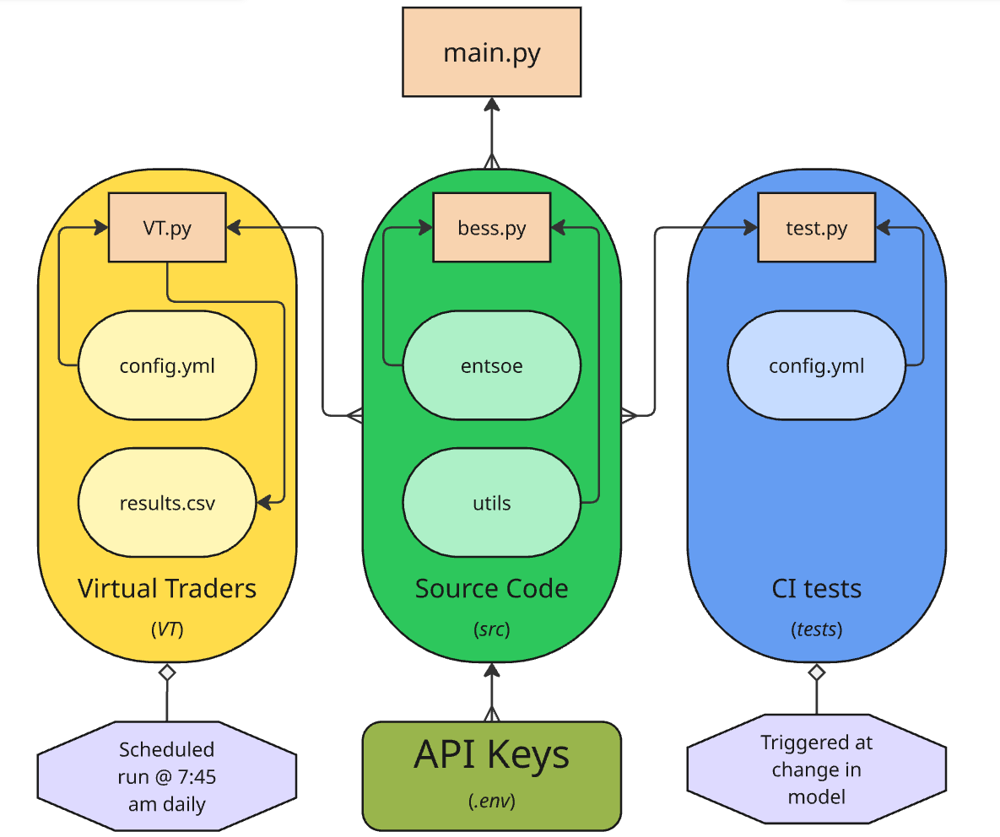
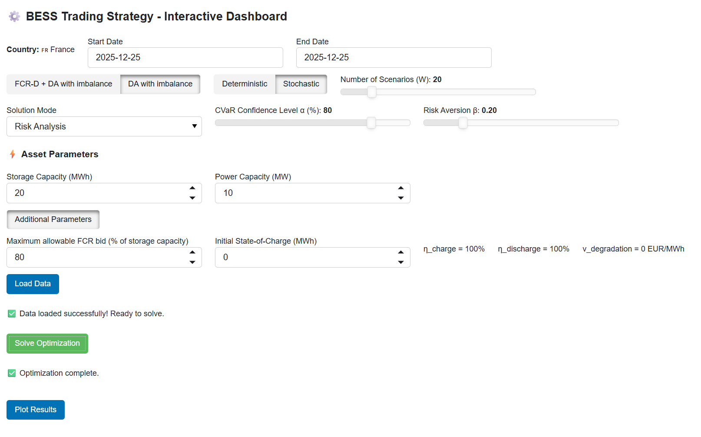
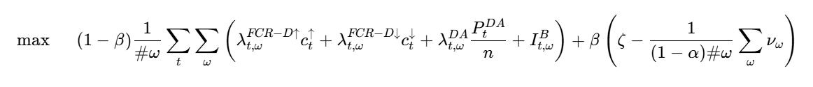
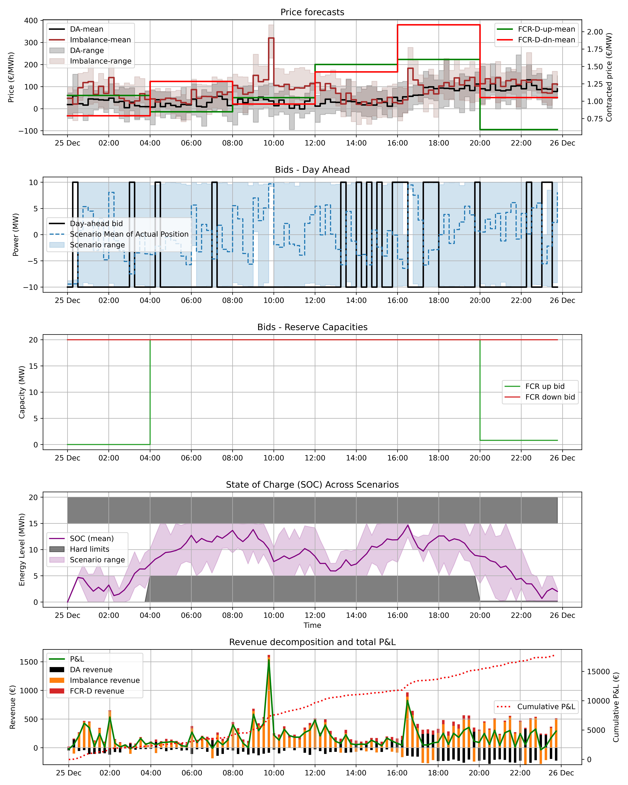
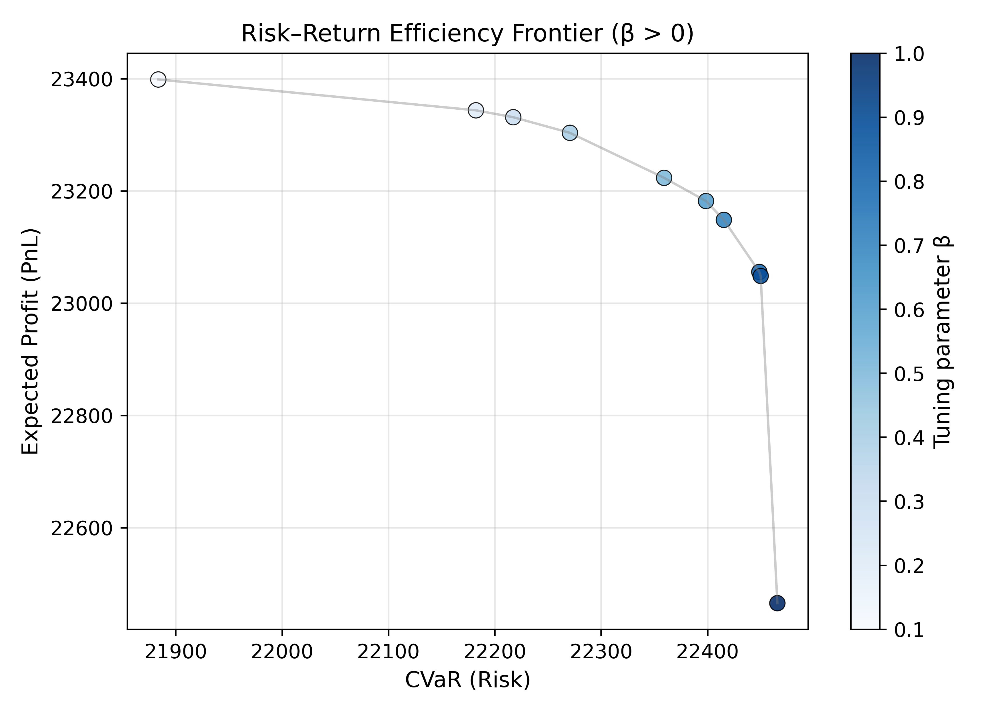

Overview of the package
---------------------------------
EnergyTrading package is aimed at providing multi-market power trading strategies for Renewable Energy and BESS assets. Take a look at the dependencies section before running the model. While execution, the code starts a Panel web server, opens a browser tab, and serves your dashboard at a local URL (default http://localhost:5006).

Dependencies
---------------------------------
1. A list of libraries needed to run the code is saved in `requirements.txt` file. Follow the instructions from the section below to install them on your virtual environment
2. An api key to access data from entso-e transparency platform. Following the steps in the [official documentation](https://transparencyplatform.zendesk.com/hc/en-us/articles/12845911031188-How-to-get-security-token), you can register on the [ENTSO-E page](https://transparency.entsoe.eu/?ref=datons.ai), and then you need to send an email to transparency@entsoe.eu with the subject “Restful API access”. After procuring your key, save it in a .env file in this package with a name "API_KEY_ENTSOE". For more info, refer to technical [API documentation](https://documenter.getpostman.com/view/7009892/2s93JtP3F6), python client for the data ([entsoe-py](https://github.com/EnergieID/entsoe-py)), [help page](https://transparencyplatform.zendesk.com/hc/en-us/articles/17260622859412-Transparency-Platform-Help-page), and interactive [data portal](https://transparency.entsoe.eu/).

Virtual Environment and Installations
---------------------------------

It is recommended to make a virtual environment and install the required packages before running the package.

1. On the target machine, create a virtual environment:

    `python3 -m venv [name of the environment]`

2. Activate the environment (replace "myenv" with the name of your virtual environment):

    `source myenv/bin/activate`

3. Install the required packages from the `requirements.txt` file (make sure to give the full path of this file):

    `pip install -r path/to/requirements.txt`

After successfully installing the necessary packages and aquiring the API key(s), the code can be run.

Navigate to the repository path from the terminal:
    `cd path/to/repository`

Then run the code using:
    `python main.py`

Repository Architecture
---------------------------------
A high level view of the architecture of the repository:

Interactive Trading Dashboard
---------------------------------
By running the `main.py` file, an interactive dashboard will be shown to optimize and trade power from a BESS asset. The dashboard allows users to configure asset parameters, select market participation schemes, solve the optimization problem, and visualize results.

- What you can do in the dashboard:
    - Select country (set to France for now) and time horizon
    - Choose market participation
    - Select optimization scheme (eg. stochastic with 100 scenarios)
    - Decide on risk-awareness
    - Configure asset parameters
    - Run and analyze results

The dashboard runs in a browser using Panel + Matplotlib and updates dynamically based on user inputs. Here is a snapshot of how the dashboard looks:

Trading Strategy
---------------------------------
A full documentation of the mathematical formulation can be found [here](docs/formulation.md).

The objective funtion dealing with FCR-D and Day-Ahead with imbalance settlement is given by:

Result Illustration
---------------------------------

The output from the trading algorithms produces 5 sub-plots:
1. Price forecasts used in the algorithm, including the uncertainity range,
2. Bids to be submitted in the Day-Ahead Market,
3. Bids to be submitted in the Ancillary service markets,
4. State of charge evolution during the planning period assuming the submitted bids are accepted. The plots also includes the uncertainity range as the balancing activation is not deterministic,
5. The Profit & Loss evolution in different markets and of overall strategy.
6. Risk-Return efficiency frontier.

Virtual Traders
---------------------------------

This package also introduces 4 Virtual Traders (VT): Alice, Bob, Charlie and Dennis. All of them use this package to trade power in the market. **Every day at 7:45 am CET**, VTs run the model according to their asset and market configuration to generate bids and potential revenue. The code and results can be found in the folder `VT/`. GitHub actions are used for the scheduled run of VT activities.

Configuration Setups:

| Alice | Bob | Charlie | Dennis |
|------|------|------|------|
|  |  |  |  |
|<ul><li>Extracts full asset value while being risk-aware</li><li>Trades Ancillary + Day-ahead with imbalance forecasts</li><li>CVaR risk management (α = 0.9, β = 0.4)</li><li>20 MWh / 10 MW BESS in France</li></ul> |<ul><li>Risk-neutral but seeks high-quality solution</li><li>Trades Ancillary + Day-ahead with imbalance forecasts</li><li>Cross-validated ex-post out-of-sample analysis</li><li>20 MWh / 10 MW BESS in France</li></ul> |<ul><li>Conservative single-market participation</li><li>Trades Day-ahead only with imbalance forecasts</li><li>CVaR risk management (α = 0.9, β = 0.4)</li><li>20 MWh / 10 MW BESS in France</li></ul> |<ul><li>Risk-neutral single-market strategy</li><li>Trades Day-ahead only with imbalance forecasts</li><li>Cross-validated ex-post out-of-sample analysis</li><li>10 MWh / 10 MW BESS in France</li></ul> |

Note: Since the forecasting package is not fully ready and not yet incorporated, VTs trade on the day after the dispatch (with added noise on the seen data) as opposed to the day before. Current works on the repo are being focused on this issue.

## 👤 Author

Nayini Venkat Aashray [[LinkedIn](https://www.linkedin.com/in/aashraynayini/)]

Email: venkat-aashray.nayini@master.polytechnique.org 
